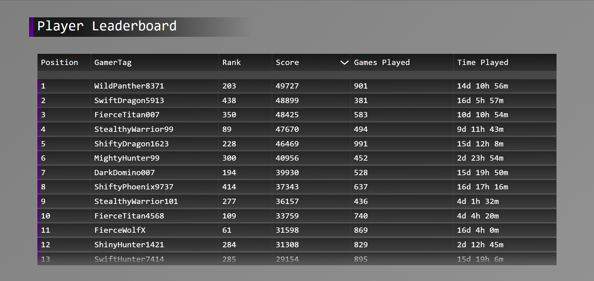

# Leaderboard System
This project is a simple leaderboard system that randomly generates data and sorts it by score by default. Each header can be clicked to sort the leaderboard according to that specific criteria, and clicking the same header twice will toggle the sorting order from descending to ascending.

## Preview

## Features
- **Responsive Design:**  Optimized for various screen sizes, ensuring a smooth experience for different screen sizes.
- **Random Data Population** Hover over weapons to view brief descriptions of the item.

## Controls
1. **Mouse Interactions**
   - **Left-Click:** Select a header sort option.

## Setup Instructions
1. Extract the contents of the zip file.
2. Open `LeaderboardSystem.html` in a web browser to preview the system.

## How to Use
1. Open the `LeaderboardSystem.html` file in a web browser to view and interact with the leaderboard system.

## Assets Used
[FlatIcon](https://www.flaticon.com/)

---

Feel free to expand or modify the leaderboard system to suit your specific needs!